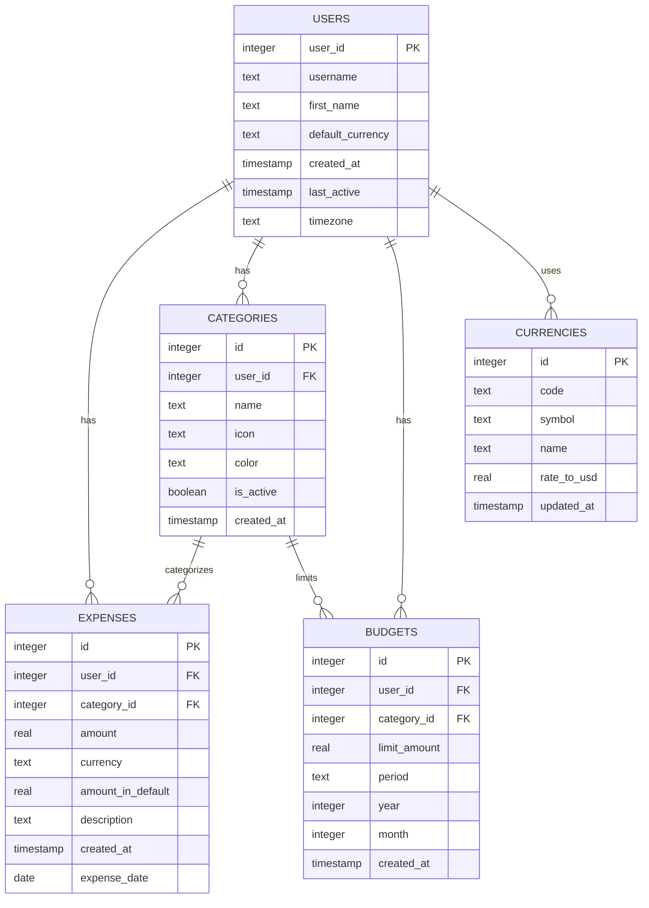
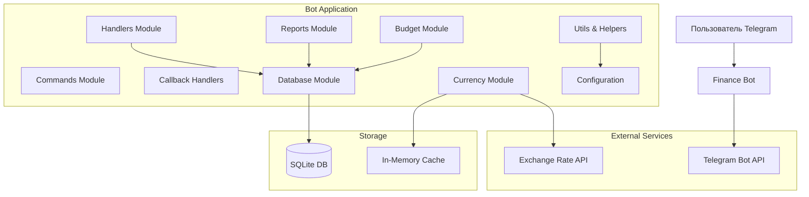
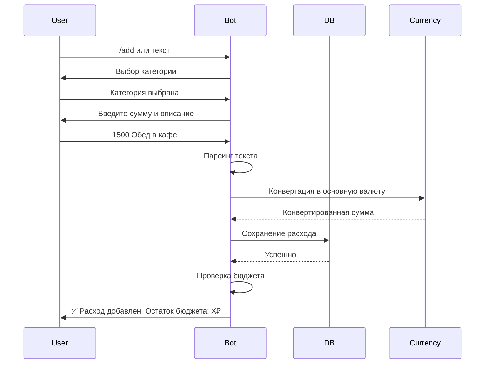
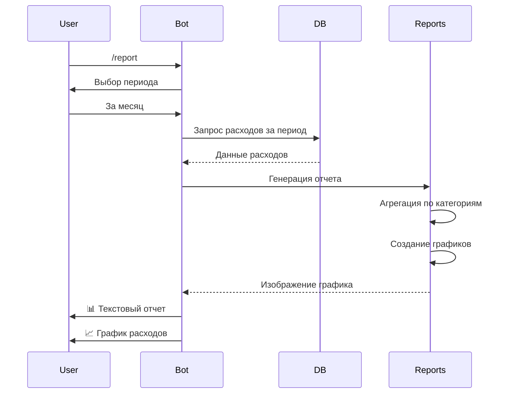
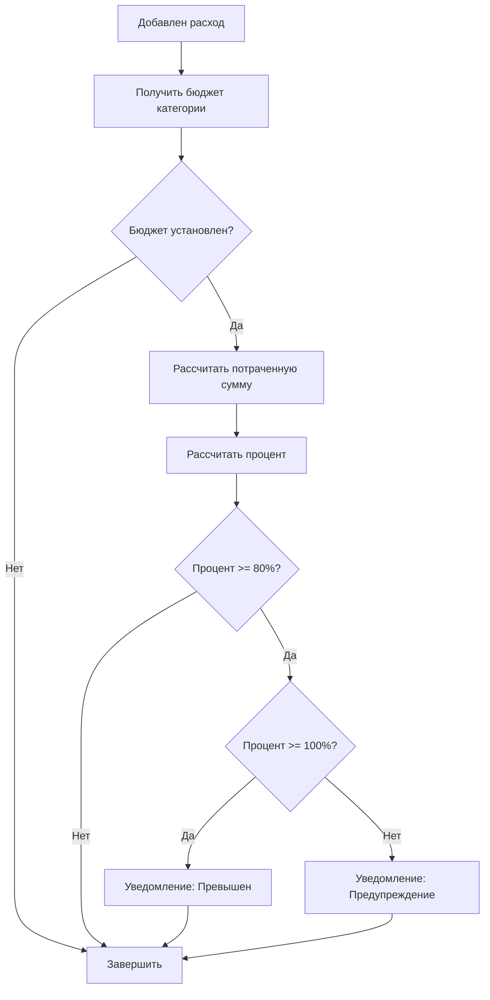
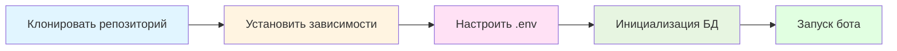

# План разработки: Telegram бот для управления финансами

## 📋 Обзор проекта

Telegram бот для учета личных финансов с возможностью отслеживания расходов, составления отчетов и планирования бюджета. Монолитная архитектура для простоты разработки и поддержки.

---

## 🎯 Функциональные требования

### Основной функционал:

1. **Учет расходов**
   - Добавление новой записи о расходе
   - Указание суммы, категории и описания
   - Быстрое добавление через inline-режим
   - История всех операций

2. **Отчеты**
   - Сводка за неделю
   - Сводка за месяц
   - Сводка за квартал
   - Сводка за год
   - Визуализация данных (графики, диаграммы)
   - Экспорт в различных форматах

3. **Управление категориями**
   - Просмотр категорий расходов
   - Добавление новых категорий
   - Редактирование существующих
   - Удаление неиспользуемых
   - Переименование категорий
   - Перенос расходов между категориями

4. **Работа с валютами**
   - Выбор основной валюты
   - Поддержка нескольких валют
   - Автоматическая конвертация
   - История курсов валют

5. **Планирование бюджета**
   - Установка лимитов по категориям
   - Месячный бюджет
   - Уведомления при превышении
   - Прогноз расходов
   - Отслеживание прогресса

---

## 🛠️ Технологический стек

### Backend & Bot
- **Язык**: Python 3.10+
- **Bot Framework**: `python-telegram-bot` v20+
- **База данных**: SQLite3 (простота + надежность)
- **ORM**: встроенный `sqlite3` (без дополнительных зависимостей)

### Дополнительные библиотеки
- **Планировщик**: `APScheduler` - для напоминаний
- **Графики**: `matplotlib` + `seaborn` - визуализация данных
- **Таблицы**: `pandas` - обработка данных
- **API курсов валют**: `requests` + ExchangeRate-API
- **Конфигурация**: `python-dotenv` - управление переменными окружения
- **Логирование**: встроенный `logging`
- **Дата/время**: `datetime`, `pytz` - работа с временем

### Преимущества выбранного стека:
✅ Простота развертывания (один файл БД)
✅ Нет зависимости от внешних сервисов
✅ Легкое резервное копирование
✅ Минимальные системные требования
✅ Быстрая разработка
✅ Простая поддержка

---

## 📊 Структура базы данных

### ER-диаграмма



### Описание таблиц

#### 1. users - Пользователи
```sql
CREATE TABLE users (
    user_id INTEGER PRIMARY KEY,
    username TEXT,
    first_name TEXT,
    default_currency TEXT DEFAULT 'RUB',
    created_at TIMESTAMP DEFAULT CURRENT_TIMESTAMP,
    last_active TIMESTAMP DEFAULT CURRENT_TIMESTAMP,
    timezone TEXT DEFAULT 'Europe/Moscow'
);
```

#### 2. expenses - Расходы
```sql
CREATE TABLE expenses (
    id INTEGER PRIMARY KEY AUTOINCREMENT,
    user_id INTEGER NOT NULL,
    category_id INTEGER NOT NULL,
    amount REAL NOT NULL,
    currency TEXT DEFAULT 'RUB',
    amount_in_default REAL NOT NULL,
    description TEXT,
    created_at TIMESTAMP DEFAULT CURRENT_TIMESTAMP,
    expense_date DATE NOT NULL,
    FOREIGN KEY (user_id) REFERENCES users(user_id),
    FOREIGN KEY (category_id) REFERENCES categories(id)
);

CREATE INDEX idx_expenses_user_date ON expenses(user_id, expense_date);
CREATE INDEX idx_expenses_category ON expenses(category_id);
```

#### 3. categories - Категории расходов
```sql
CREATE TABLE categories (
    id INTEGER PRIMARY KEY AUTOINCREMENT,
    user_id INTEGER NOT NULL,
    name TEXT NOT NULL,
    icon TEXT DEFAULT '📦',
    color TEXT DEFAULT '#808080',
    is_active BOOLEAN DEFAULT 1,
    created_at TIMESTAMP DEFAULT CURRENT_TIMESTAMP,
    FOREIGN KEY (user_id) REFERENCES users(user_id),
    UNIQUE(user_id, name)
);

-- Предустановленные категории (добавляются при регистрации)
-- 🍔 Еда и напитки
-- 🚗 Транспорт
-- 🏠 Жилье
-- 💊 Здоровье
-- 👕 Одежда
-- 🎮 Развлечения
-- 📚 Образование
-- 💰 Прочее
```

#### 4. budgets - Бюджеты
```sql
CREATE TABLE budgets (
    id INTEGER PRIMARY KEY AUTOINCREMENT,
    user_id INTEGER NOT NULL,
    category_id INTEGER,
    limit_amount REAL NOT NULL,
    period TEXT DEFAULT 'month',
    year INTEGER NOT NULL,
    month INTEGER,
    created_at TIMESTAMP DEFAULT CURRENT_TIMESTAMP,
    FOREIGN KEY (user_id) REFERENCES users(user_id),
    FOREIGN KEY (category_id) REFERENCES categories(id),
    UNIQUE(user_id, category_id, year, month)
);
```

#### 5. currencies - Валюты
```sql
CREATE TABLE currencies (
    id INTEGER PRIMARY KEY AUTOINCREMENT,
    code TEXT UNIQUE NOT NULL,
    symbol TEXT NOT NULL,
    name TEXT NOT NULL,
    rate_to_usd REAL NOT NULL DEFAULT 1.0,
    updated_at TIMESTAMP DEFAULT CURRENT_TIMESTAMP
);

-- Предустановленные валюты
-- RUB ₽, USD $, EUR €, GBP £, CNY ¥, KZT ₸
```

---

## 🤖 Архитектура бота

### Компонентная диаграмма



### Модули системы

#### 1. **main.py** - Точка входа
- Инициализация бота
- Регистрация handlers
- Запуск polling/webhook
- Обработка ошибок

#### 2. **database.py** - Работа с БД
- CRUD операции для всех таблиц
- Миграции схемы
- Резервное копирование
- Оптимизация запросов

#### 3. **handlers.py** - Обработчики команд
- `/start` - приветствие и регистрация
- `/help` - справка по командам
- `/add` - добавление расхода
- `/report` - выбор периода отчета
- `/budget` - управление бюджетом
- `/categories` - управление категориями
- `/currency` - настройка валюты
- `/settings` - настройки пользователя
- `/export` - экспорт данных

#### 4. **reports.py** - Генерация отчетов
- Агрегация данных по периодам
- Создание графиков
- Форматирование текстовых отчетов
- Генерация PDF (опционально)

#### 5. **budget.py** - Управление бюджетом
- Установка лимитов
- Проверка превышения
- Прогнозирование
- Уведомления

#### 6. **currency.py** - Работа с валютами
- Получение курсов
- Конвертация сумм
- Кэширование курсов
- Обновление в фоне

#### 7. **keyboards.py** - Клавиатуры
- Inline клавиатуры
- Reply клавиатуры
- Динамическое создание

#### 8. **utils.py** - Утилиты
- Форматирование дат
- Валидация данных
- Парсинг текста
- Логирование

#### 9. **config.py** - Конфигурация
- Константы
- Настройки
- Переменные окружения

---

## 🔄 Блок-схема работы бота

### Процесс добавления расхода



### Процесс генерации отчета



---

## 💬 Команды и интерфейс бота

### Основные команды

| Команда | Описание | Пример |
|---------|----------|--------|
| `/start` | Начало работы с ботом | `/start` |
| `/help` | Справка по командам | `/help` |
| `/add` | Добавить расход | `/add` или `500 еда` |
| `/report` | Получить отчет | `/report` |
| `/budget` | Управление бюджетом | `/budget` |
| `/categories` | Управление категориями | `/categories` |
| `/currency` | Настройка валюты | `/currency` |
| `/settings` | Настройки | `/settings` |
| `/export` | Экспорт данных | `/export` |
| `/stats` | Статистика | `/stats` |

### Быстрое добавление расходов

Пользователь может отправить текст в формате:
- `500` - расход 500₽ (категория "Прочее")
- `500 еда` - расход 500₽ в категорию "Еда"
- `500 RUB такси` - расход 500₽ в категорию "Транспорт"
- `100$ одежда` - расход 100$ в категорию "Одежда"

### Inline клавиатуры

#### Главное меню
```
┌─────────────────────────────┐
│  💰 Добавить расход         │
│  📊 Отчеты                  │
│  🎯 Бюджет                  │
│  📋 Категории               │
│  💱 Валюта                  │
│  ⚙️ Настройки              │
└─────────────────────────────┘
```

#### Выбор категории
```
┌──────────┬──────────┬──────────┐
│ 🍔 Еда   │ 🚗 Транс │ 🏠 Жилье │
├──────────┼──────────┼──────────┤
│ 💊 Здоро │ 👕 Одежд │ 🎮 Развл │
├──────────┼──────────┼──────────┤
│ 📚 Образ │ 💰 Прочее│          │
└──────────┴──────────┴──────────┘
```

#### Период отчета
```
┌─────────────────┬─────────────────┐
│  📅 Неделя      │  📅 Месяц       │
├─────────────────┼─────────────────┤
│  📅 Квартал     │  📅 Год         │
├─────────────────┴─────────────────┤
│  📊 Произвольный период           │
└───────────────────────────────────┘
```

---

## 📈 Модуль отчетов

### Типы отчетов

#### 1. Текстовый отчет
```
📊 Отчет за январь 2026

Общие расходы: 45 670₽

По категориям:
🍔 Еда и напитки: 15 230₽ (33.3%)
🚗 Транспорт: 8 500₽ (18.6%)
🏠 Жилье: 12 000₽ (26.3%)
💊 Здоровье: 3 200₽ (7.0%)
👕 Одежда: 4 500₽ (9.9%)
🎮 Развлечения: 2 240₽ (4.9%)

Бюджет: 50 000₽
Осталось: 4 330₽ (8.7%)
Средний расход в день: 1 473₽
```

#### 2. Графический отчет
- Круговая диаграмма (распределение по категориям)
- Столбчатая диаграмма (расходы по дням)
- Линейный график (тренд за период)
- Тепловая карта (расходы по дням недели)

#### 3. Сравнительный отчет
- Сравнение с прошлым периодом
- Динамика изменений
- Топ-5 категорий

---

## 🎯 Модуль бюджетирования

### Функции

1. **Установка общего бюджета**
   - Месячный лимит
   - Автоматическое обновление

2. **Бюджет по категориям**
   - Индивидуальные лимиты
   - Гибкая настройка

3. **Уведомления**
   - 80% бюджета использовано
   - 100% бюджета исчерпан
   - Ежедневная сводка

4. **Прогнозирование**
   - Оценка расходов до конца месяца
   - Рекомендации по экономии

### Алгоритм проверки бюджета



---

## 💱 Модуль валют

### Поддерживаемые валюты

| Код | Символ | Название |
|-----|--------|----------|
| RUB | ₽ | Российский рубль |
| USD | $ | Доллар США |
| EUR | € | Евро |
| GBP | £ | Фунт стерлингов |
| CNY | ¥ | Китайский юань |
| KZT | ₸ | Казахстанский тенге |

### Функции

1. **Автоматическое обновление курсов**
   - Каждые 6 часов через ExchangeRate-API
   - Кэширование в БД

2. **Конвертация при добавлении**
   - Автоматический пересчет в основную валюту
   - Сохранение исходной суммы

3. **Изменение основной валюты**
   - Пересчет всех расходов
   - Обновление бюджетов

4. **Fallback механизм**
   - Локальные курсы при недоступности API
   - Уведомление об устаревших данных

---

## 📁 Структура проекта

```
finance-telegram-bot/
│
├── bot/
│   ├── __init__.py
│   ├── main.py              # Точка входа приложения
│   ├── config.py            # Конфигурация и константы
│   │
│   ├── database/
│   │   ├── __init__.py
│   │   ├── db.py            # Класс Database
│   │   ├── models.py        # SQL схемы
│   │   └── migrations.py    # Миграции БД
│   │
│   ├── handlers/
│   │   ├── __init__.py
│   │   ├── start.py         # /start, /help
│   │   ├── expenses.py      # Добавление расходов
│   │   ├── reports.py       # Отчеты
│   │   ├── budget.py        # Бюджет
│   │   ├── categories.py    # Категории
│   │   ├── currency.py      # Валюты
│   │   └── settings.py      # Настройки
│   │
│   ├── services/
│   │   ├── __init__.py
│   │   ├── expense_service.py
│   │   ├── report_service.py
│   │   ├── budget_service.py
│   │   ├── currency_service.py
│   │   └── notification_service.py
│   │
│   ├── utils/
│   │   ├── __init__.py
│   │   ├── keyboards.py     # Клавиатуры
│   │   ├── parsers.py       # Парсинг текста
│   │   ├── formatters.py    # Форматирование
│   │   ├── validators.py    # Валидация
│   │   └── charts.py        # Генерация графиков
│   │
│   └── middleware/
│       ├── __init__.py
│       ├── auth.py          # Проверка пользователя
│       └── logging.py       # Логирование действий
│
├── data/
│   ├── finance_bot.db       # База данных (создается автоматически)
│   └── backups/             # Резервные копии
│
├── logs/
│   └── bot.log              # Логи приложения
│
├── tests/
│   ├── __init__.py
│   ├── test_database.py
│   ├── test_services.py
│   └── test_parsers.py
│
├── .env                     # Переменные окружения
├── .env.example             # Пример конфигурации
├── .gitignore
├── requirements.txt         # Зависимости
├── README.md                # Документация
└── run.sh                   # Скрипт запуска
```

---

## 📦 Зависимости (requirements.txt)

```txt
# Telegram Bot
python-telegram-bot==20.7

# Database
# sqlite3 встроен в Python

# Data Processing
pandas==2.1.4

# Visualization
matplotlib==3.8.2
seaborn==0.13.1

# Scheduling
APScheduler==3.10.4

# HTTP Requests
requests==2.31.0

# Environment Variables
python-dotenv==1.0.0

# Timezone
pytz==2023.3

# PDF Generation (optional)
reportlab==4.0.7

# Testing
pytest==7.4.3
pytest-asyncio==0.21.1
```

---

## 🔐 Конфигурация (.env)

```env
# Telegram Bot Token
TELEGRAM_BOT_TOKEN=your_bot_token_here

# Exchange Rate API (free tier)
EXCHANGE_API_KEY=your_api_key_here
EXCHANGE_API_URL=https://v6.exchangerate-api.com/v6

# Database
DATABASE_PATH=data/finance_bot.db

# Logging
LOG_LEVEL=INFO
LOG_FILE=logs/bot.log

# Currency Update Interval (hours)
CURRENCY_UPDATE_INTERVAL=6

# Default Settings
DEFAULT_CURRENCY=RUB
DEFAULT_TIMEZONE=Europe/Moscow

# Backup
BACKUP_ENABLED=true
BACKUP_INTERVAL_DAYS=7
BACKUP_PATH=data/backups
```

---

## 🚀 План развертывания

### Локальное развертывание



### Шаги установки

1. **Клонирование и настройка**
```bash
git clone <repository>
cd finance-telegram-bot
python -m venv venv
source venv/bin/activate  # Windows: venv\Scripts\activate
pip install -r requirements.txt
```

2. **Конфигурация**
```bash
cp .env.example .env
# Отредактировать .env и добавить токен бота
```

3. **Запуск**
```bash
python -m bot.main
```

### Развертывание на сервере

#### Вариант 1: VPS (Ubuntu/Debian)

```bash
# Установка зависимостей
sudo apt update
sudo apt install python3.10 python3-pip python3-venv

# Настройка проекта
cd /opt
sudo git clone <repository> finance-bot
cd finance-bot
sudo python3 -m venv venv
sudo venv/bin/pip install -r requirements.txt

# Настройка .env
sudo nano .env

# Создание systemd service
sudo nano /etc/systemd/system/finance-bot.service
```

**finance-bot.service**:
```ini
[Unit]
Description=Finance Telegram Bot
After=network.target

[Service]
Type=simple
User=www-data
WorkingDirectory=/opt/finance-bot
Environment="PATH=/opt/finance-bot/venv/bin"
ExecStart=/opt/finance-bot/venv/bin/python -m bot.main
Restart=always
RestartSec=10

[Install]
WantedBy=multi-user.target
```

```bash
# Запуск сервиса
sudo systemctl daemon-reload
sudo systemctl enable finance-bot
sudo systemctl start finance-bot
sudo systemctl status finance-bot
```

#### Вариант 2: Docker

**Dockerfile**:
```dockerfile
FROM python:3.10-slim

WORKDIR /app

COPY requirements.txt .
RUN pip install --no-cache-dir -r requirements.txt

COPY . .

RUN mkdir -p data logs

CMD ["python", "-m", "bot.main"]
```

**docker-compose.yml**:
```yaml
version: '3.8'

services:
  finance-bot:
    build: .
    container_name: finance-telegram-bot
    restart: unless-stopped
    volumes:
      - ./data:/app/data
      - ./logs:/app/logs
    env_file:
      - .env
```

Запуск:
```bash
docker-compose up -d
```

---

## 🛡️ Безопасность

### Меры защиты

1. **Токен бота**
   - Хранение в `.env`
   - Не коммитить в git
   - Регулярная ротация

2. **Данные пользователей**
   - Локальное хранение
   - Шифрование БД (опционально)
   - Регулярные бэкапы

3. **Валидация входных данных**
   - Проверка типов
   - Санитизация текста
   - Ограничение размера данных

4. **Ограничение доступа**
   - Только зарегистрированные пользователи
   - Rate limiting (встроенный в python-telegram-bot)

5. **Логирование**
   - Все действия пользователей
   - Ошибки и исключения
   - Ротация логов

---

## 📊 Мониторинг и обслуживание

### Логирование

```python
# Уровни логирования
DEBUG - детальная отладочная информация
INFO - основные события (команды, действия)
WARNING - предупреждения
ERROR - ошибки
CRITICAL - критические ошибки
```

### Резервное копирование

Автоматическое создание бэкапов БД:
- Ежедневно в 03:00
- Хранение последних 30 копий
- Формат: `finance_bot_YYYY-MM-DD.db`

### Мониторинг

- Проверка работоспособности через healthcheck
- Уведомления администратора о критических ошибках
- Статистика использования

---

## 🔄 План разработки (этапы)

### Этап 1: Базовая функциональность
- [x] Инициализация проекта
- [x] Структура БД
- [x] Базовые handlers
- [x] Добавление расходов
- [x] Просмотр истории

### Этап 2: Категории и отчеты
- [x] Управление категориями
- [x] Текстовые отчеты
- [x] Базовые графики
- [x] Периоды отчетов

### Этап 3: Валюты
- [x] Поддержка валют
- [x] API курсов
- [x] Конвертация
- [x] Кэширование

### Этап 4: Бюджетирование
- [x] Установка бюджетов
- [x] Отслеживание
- [x] Уведомления
- [x] Прогнозирование

### Этап 5: Улучшения
- [x] Экспорт данных
- [x] Статистика
- [x] Оптимизация
- [x] Тестирование

---

## 📚 Примеры использования

### Сценарий 1: Первый запуск

```
Пользователь: /start

Бот: 👋 Добро пожаловать в Finance Bot!

Я помогу вам управлять личными финансами.

Выберите вашу основную валюту:
[RUB ₽] [USD $] [EUR €]

Пользователь: [RUB ₽]

Бот: ✅ Валюта установлена: RUB ₽

Для вас созданы базовые категории:
🍔 Еда и напитки
🚗 Транспорт
🏠 Жилье
💊 Здоровье
👕 Одежда
🎮 Развлечения
📚 Образование
💰 Прочее

Начните добавлять расходы:
• Команда /add
• Или просто напишите сумму: "500 еда"

Нужна помощь? Используйте /help
```

### Сценарий 2: Добавление расхода

```
Пользователь: 1500 обед

Бот: 💰 Добавить расход

Сумма: 1500 ₽
Описание: обед

Выберите категорию:
[🍔 Еда] [🚗 Транспорт] [🏠 Жилье]
[💊 Здоровье] [👕 Одежда] [🎮 Развлечения]

Пользователь: [🍔 Еда]

Бот: ✅ Расход добавлен!

💰 1500 ₽ - обед
🍔 Категория: Еда и напитки
📅 Дата: 03.03.2026

Бюджет "Еда": 8500 / 15000 ₽ (56.7%)
Осталось: 6500 ₽
```

### Сценарий 3: Месячный отчет

```
Пользователь: /report

Бот: 📊 Выберите период отчета:
[📅 Неделя] [📅 Месяц]
[📅 Квартал] [📅 Год]

Пользователь: [📅 Месяц]

Бот: 📊 Отчет за февраль 2026

Общие расходы: 42 350 ₽

По категориям:
🍔 Еда: 14 230 ₽ (33.6%)
🚗 Транспорт: 7 500 ₽ (17.7%)
🏠 Жилье: 12 000 ₽ (28.3%)
💊 Здоровье: 2 800 ₽ (6.6%)
👕 Одежда: 3 520 ₽ (8.3%)
🎮 Развлечения: 2 300 ₽ (5.4%)

📈 Статистика:
Средний расход в день: 1 512 ₽
Самый дорогой день: 15.02 (4 250 ₽)
Всего операций: 28

💰 Бюджет: 45 000 ₽
✅ Осталось: 2 650 ₽ (5.9%)

[📈 Показать график]

Бот: [Отправляет график с диаграммами]
```

---

## 🎨 Дополнительные возможности (v2.0)

### Планируемые улучшения

1. **Доходы**
   - Учет доходов
   - Категории доходов
   - Баланс (доходы - расходы)

2. **Цели накоплений**
   - Установка целей
   - Отслеживание прогресса
   - Автоматический расчет ежемесячных отчислений

3. **Повторяющиеся расходы**
   - Подписки
   - Регулярные платежи
   - Автоматическое добавление

4. **Аналитика**
   - Тренды расходов
   - Прогнозы
   - Рекомендации по экономии

5. **Совместное использование**
   - Семейный бюджет
   - Общие категории
   - Совместные отчеты

6. **Интеграции**
   - Экспорт в Google Sheets
   - Уведомления в Email
   - Telegram каналы для отчетов

---

## ✅ Критерии готовности

### MVP (Минимальный функционал)
- [x] Регистрация пользователей
- [x] Добавление расходов
- [x] Базовые категории
- [x] Простые отчеты (текст)
- [x] История расходов

### v1.0 (Полный функционал)
- [x] Все команды реализованы
- [x] Управление категориями
- [x] Поддержка валют
- [x] Графические отчеты
- [x] Бюджетирование
- [x] Уведомления
- [x] Экспорт данных

### Production Ready
- [x] Обработка всех ошибок
- [x] Логирование
- [x] Тесты покрывают 70%+ кода
- [x] Документация
- [x] Резервное копирование
- [x] Мониторинг

---

## 📖 Документация для пользователей

### Команда /help

```
📖 Справка по командам

💰 Основные команды:
/add - Добавить расход
/report - Получить отчет
/budget - Управление бюджетом
/categories - Управление категориями
/currency - Настройка валюты

⚙️ Дополнительные:
/stats - Статистика
/export - Экспорт данных
/settings - Настройки

❓ Быстрое добавление:
Просто отправьте сумму и описание:
• "500" - расход 500₽
• "500 еда" - 500₽ в категорию "Еда"
• "100$ такси" - 100$ в категорию "Транспорт"

💡 Советы:
• Используйте категории для точного учета
• Проверяйте отчеты регулярно
• Установите бюджеты для контроля расходов
```

---

## 🚀 Готов к реализации!

План полностью разработан и готов к переходу в режим **Code** для реализации.

### Рекомендуемый порядок разработки:
1. Базовая структура + БД (2-3 часа)
2. Handlers и команды (3-4 часа)
3. Отчеты и графики (2-3 часа)
4. Валюты и конвертация (1-2 часа)
5. Бюджетирование (2-3 часа)
6. Тестирование и отладка (2-3 часа)

**Общее время разработки MVP: 12-18 часов**
**Полная версия v1.0: 20-25 часов**
